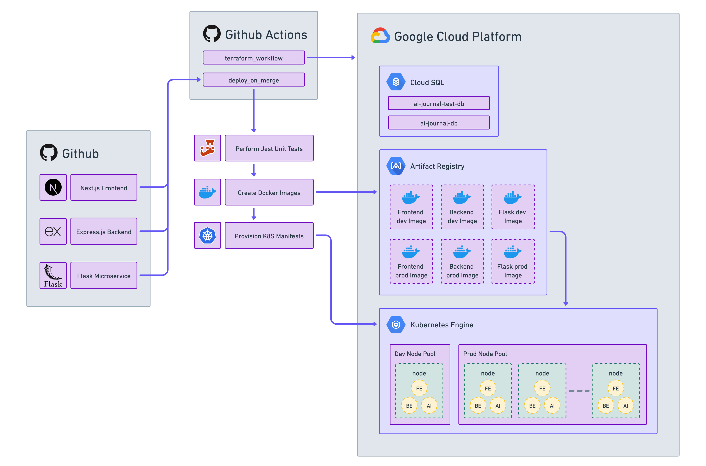

<!-- PROJECT LOGO -->
 

  <h1 align="center">☕️ Espressly</h1>

  

  Open-source AI-assisted journaling and mood-tracking application designed to improve mental health using insightful analysis and personalized support for their users' mental well-being
  

  

  
 
    <a href="https://www.youtube.com/shorts/voc3S9PHeCI">View Demo</a>
    |
    <a href="https://github.com/DSC-McMaster-U/ai-journal/issues/new?assignees=&labels=&projects=&template=bug_report.md&title=">Report Bug</a>
    |
    <a href="https://github.com/DSC-McMaster-U/ai-journal/issues/new?assignees=&labels=&projects=&template=feature_request.md&title=">Request Feature</a>

<!-- TOOLS -->

## 🛠️ Built With

### Frontend

### Backend & Microservices

### CI/CD

## 🗄️ Database Architecture

## ☁️ CI/CD

## 🧑‍💻 Contributors

| 
 Contributor 
                                                                     | Most Used Frameworks/Tools                                                                                                                                                                                                                                                                                                                                                                                                                                                   | Links                                                                                                                                                                                       |
| ---------------------------------------------------------------------------------------------------------------- | ---------------------------------------------------------------------------------------------------------------------------------------------------------------------------------------------------------------------------------------------------------------------------------------------------------------------------------------------------------------------------------------------------------------------------------------------------------------------------- | ------------------------------------------------------------------------------------------------------------------------------------------------------------------------------------------- |
|    **Zayn Abed**   <i/> Project Lead </img> |     | <ul><li>[zaynabed.com](https://www.zaynabed.com/)</li> <li>[github/abedmohammed](https://github.com/abedmohammed)</li><li> [in/zayn-abed](https://www.linkedin.com/in/zayn-abed/)</li></ul> |

<a href="#readme-top">back to top</a>

